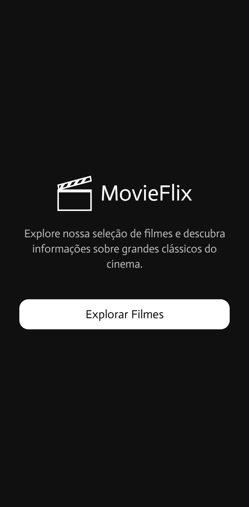
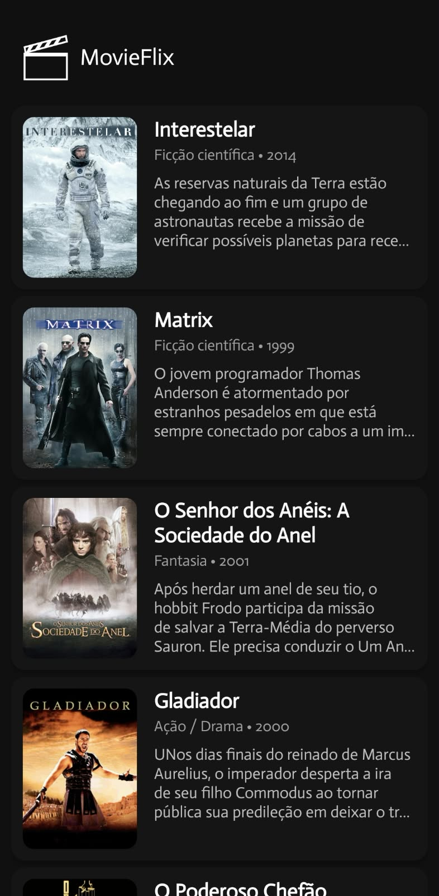
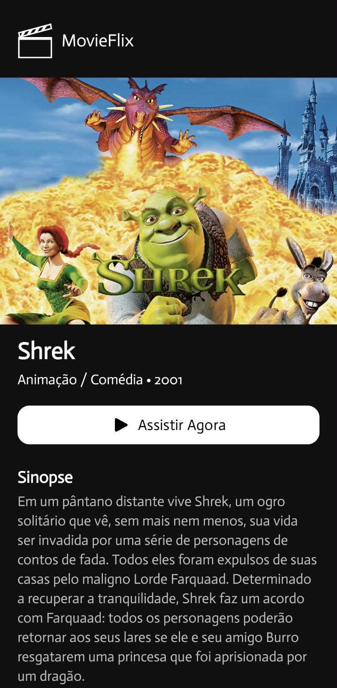

# MovieFlix

Aplicativo Android desenvolvido em Java para exibição de uma lista de filmes utilizando `RecyclerView`.

O projeto apresenta uma interface inspirada em plataformas de streaming, permitindo visualizar uma coleção de filmes, abrir uma tela com informações detalhadas e remover itens da lista por meio de clique longo.

---
## Interface

O aplicativo possui três telas principais:

| Tela inicial | Lista de filmes | Detalhes do filme |
|---|---|---|
|  |  |  |

## Funcionalidades

O aplicativo possui as seguintes funcionalidades:

- Tela inicial com apresentação do aplicativo;
- Exibição dos filmes em um `RecyclerView`;
- Exibição de cada filme detalhada;
- Remoção de um filme através de clique longo;
- Carregamento de imagens externas utilizando Glide;

---

## Componentes utilizados

A interface do aplicativo utiliza componentes do Android e do Material Design, como:

- `TextView` — exibe títulos, gêneros, anos e descrições dos filmes;
- `ImageView` — exibe pôsteres, logos e ícones;
- `RecyclerView` — exibe a lista de filmes;
- `MaterialCardView` — organiza visualmente cada item da lista;
- `MaterialButton` — utilizado nos botões de navegação e ação;
- `FrameLayout` — permite sobrepor o logo sobre a imagem do filme;
- `ScrollView` — permite rolar o conteúdo da tela de detalhes;
- `include` — reutiliza o layout do cabeçalho em diferentes telas.

Além dos componentes visuais, o aplicativo utiliza:

- `Intent` — realiza a navegação entre Activities;
- `Serializable` — permite enviar o objeto `Filme` entre telas;
- `Adapter` — conecta a lista de filmes ao `RecyclerView`;
- `ViewHolder` — mantém referências aos componentes de cada item;
- `Glide` — carrega as imagens dos filmes a partir de URLs;
- `Toast` — exibe mensagens ao usuário, como a confirmação de remoção de um filme.
